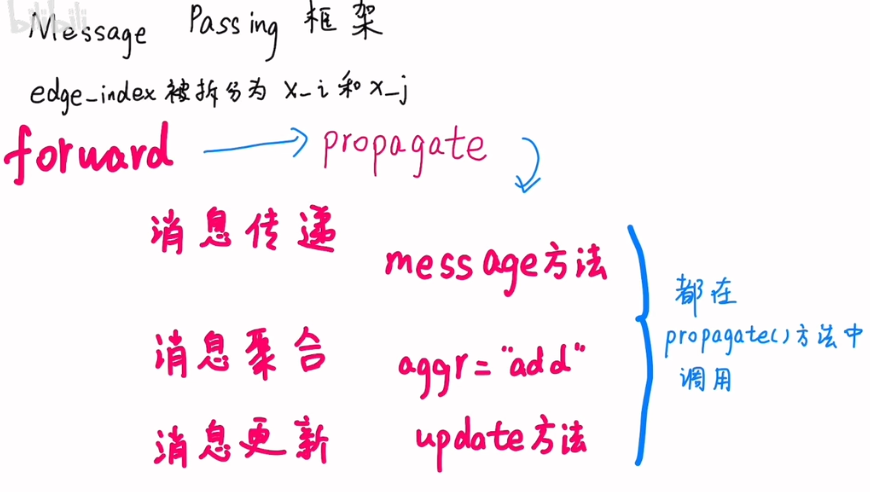

## Messagepassing

### 1. Messagepassing phase

### 2. Definitions

### 3. Heterogeneous graphs

* [https://pytorch-geometric.readthedocs.io/en/2.5.0/advanced/hgam.html](https://pytorch-geometric.readthedocs.io/en/2.5.0/advanced/hgam.html)

* Multiagent Reinforcement Learning With Heterogeneous Graph Attention Network [[Paper]](https://ieeexplore.ieee.org/document/9940201)
* "Unified heterogeneous transformer-based graph neural network for motion prediction" [[Code]](https://github.com/OpenDriveLab/HDGT/tree/main)
* "Multi-Agent Trajectory Prediction with Heterogeneous  Edge-Enhanced Graph Attention Network" [[Code]](https://github.com/Xiaoyu006/MATP-with-HEAT)
* "InforMARL: Scalable Multi-Agent Reinforcement Learning through Intelligent Information Aggregation." [[Paper]](https://nsidn98.github.io/InforMARL/) [[Code]](https://github.com/nsidn98/InforMARL)