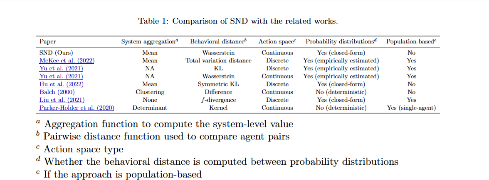

## Heterogeneous Multi-robot Cooperation
### 1. Challenges in MARL
1. "Challenges in MARL (Ning and Xie)" [[Blog]](https://vinaylanka.medium.com/multi-agent-reinforcement-learning-marl-1d55dfff6439)
   
### 2. Behavior Diversity
1. "Heterogeneous Multi-Robot Reinforcement Learning". [[Paper]](https://arxiv.org/pdf/2301.07137) [[Code]](https://github.com/proroklab/HetGPPO) [[BenchMARL]](https://matteobettini.com/publication/benchmarl/) [[TorchRL]](https://github.com/pytorch/rl/tree/main/sota-implementations/multiagent) [[VMAS]](https://github.com/proroklab/VectorizedMultiAgentSimulator) 
   * Physical heterogeneous: when one of agents' or robots' components differs from the others in terms of hardware or physical constraints. e.g., different sensors, actuators, motion constraints, etc. This type of heterogeneity can lead to different observation and action spaces.
    * Behavioral heterogeneous: when at least one of its components differs from the others in terms of software or behavioral model. That is, two hehaviorally heterogeneous agents can produce distinct policy outputs when observing the same input.
        * Same objective: agents share the same objective function through heterogeneous behavior. In MARL, this means that they share the same (global or local) reward function. e.g., cooperative settings, or in adversarial scenarios where the agents with the same objective compete for limited resources.
        * Different objective: agents optimize the different objective function through heterogeneous behaviors. In MARL, this means that they have different local reward function or a global reward deriving from the composition of such local functions. e.g., non-cooperative or adversarial setting. However, it can also model cooperative scenarios where agents optimize different sub-functions for a higher-order tasks.
    * Heterogeneity in MARL: 1) Physical heterogeneity: agent indexing, mapping heterogeneous obervation spaces into homogeneous fixed-length encodings, or by padding and including the agent index into observations. 2)Behavioral heterogeneity: intrinsic reward
    * HetGPPO learns individual agnet policies: 1) Use neighbourhood communication to overcome partial observability. 2) Allows decentralized training of GNNs.
    * This study found that homogeneous agents are able to infer behavioral roles through observations, emulating heterogeneous behavior, which is call **behavioral typing**.
    
    
        
    
2. "System Neural Diversity: Measuring Behavioral Heterogeneity in Multi-Agent Learning" [[Paper]](https://arxiv.org/pdf/2305.02128)

2. "**Controlling Behavioral Diversity in Multi-Agent Reinforcement Learning**" [[Paper]](https://arxiv.org/abs/2405.15054) [[Code]]()
    * How to control the diversity of a multi-agent system to an exact, quantified value?
    * Behavioral diversity in MARL is intrinsically tied to the con- cept of policy parameter sharing (Christianos et al., 2021).  When agents share policy parameters, they obtain higher sample efficiency, but learn a single homogeneous policy.  When agents do not share parameters, they are able to learn heterogeneous policies, but achieve lower sample efficiency
    * A common solution to promote diversity among agents in a system is to design an intrinsic reward that is added to the task reward, creating an auxiliary objective for the agents
3. "**Measuring Policy Distance for Multi-Agent Reinforcement Learning**" [[Paper]](https://arxiv.org/pdf/2401.11257) [[Code]](https://github.com/Harry67Hu/MADPS)
    * SND methods assume the action distributionis Gaussian distribution. This work argue that the agents might take actions under different distributions, such as bimodal. Things may get worse in scenarios when agents take discrete actions.
    * Policy diversity: 1)incorporate agent indices into the observations. 2)group the agents based on prior knowledge or learned information, only sharing parameters within groups. 3)sharing parameters based on their roles.
    * Policy distance metric: KL divergence, MMD, W-distance, compute the policy distance by integrating the distances of the latent distributions instead of directly measuring the policies.
    * Dynamic parameter sharing: Fuse the policies of closely releated agents while dividing the policies of agents with significant differences.
4. "When Is Diversity Rewarded in Cooperative Multi-Agent Learning?" [[Paper]](https://arxiv.org/pdf/2506.09434)
    * Research questions: under what conditions will heterogeneous agents outperform the best homogeneous baseline ?
5. "Celebrating Diversity in Shared Multi-Agent Reinforcement Learning" [[Paper]](https://openreview.net/forum?id=CO87OIEOGU8) [[Code]](https://github.com/lich14/CDS)
    * DS achieves remarkable success in challenging benchmarks SMAC and GRF by balancing sharing and diversity.
6. "Heterogeneous Skill Learning for Multi-agent Tasks " [[Paper]](https://proceedings.neurips.cc/paper_files/paper/2022/hash/f0606b882692637835e8ac981089eccd-Abstract-Conference.html) [[Code]]()
    * To promote efficient skill discovery, a mutual information based intrinsic reward function is constructed
7. "Dynamic Parameter Sharing in Multi-Agent Reinforcement Learning for Spatio-Temporal Resource Allocation" [[Paper]](https://dl.acm.org/doi/10.1145/3637528.3672052) [[Code]](https://github.com/tsinghua-fib-lab/DyPS/tree/main)
8. "**Learning Flexible Heterogeneous Coordination With Capability-Aware Shared Hypernetworks**" [[Paper]](https://www.arxiv.org/abs/2501.06058v1) [[Code]]()
    * Introduces soft parameter sharing in heterogeneous multi-robot learning, establishing a new middle ground between shared and individualized parameter approaches.
    * Use Hypernetworks to flexibly determine parameters within individual robots’ policy or value networks based on their capabilities and local observations
9. "Scaling Multi-Agent Reinforcement Learning with Selective Parameter Sharing"  [[Paper]](https://arxiv.org/abs/2102.07475) [[Code]]()
10. "Selectively Sharing Experiences Improves Multi-Agent Reinforcement Learning" [[Paper]](https://openreview.net/forum?id=DpuphOgJqh&noteId=UhjBgbqvOt) [[Code]]()
12. "Learning Heterogeneous Agent Collaboration in Decentralized Multi-Agent Systems via Intrinsic Motivation" [[Paper]](https://arxiv.org/pdf/2408.06503) [[Code]](https://github.com/jahirsadik/CoHet-Implementation)
13. "Policy Diagnosis via Measuring Role Diversity in Cooperative Multi-agent RL" [[Paper]](https://arxiv.org/abs/2207.05683)
14. "Hybrid Actor-Critic for Physically Heterogeneous Multi-Agent Reinforcement Learning " [[Paper]](https://ieeexplore.ieee.org/document/11006503)

### 3. Common and Platform
1. "Revisiting Some Common Practices in Cooperative Multi-Agent Reinforcement Learning " [[Paper]](https://arxiv.org/abs/2206.07505)
2. "Heterogeneous Multi-Robot Cooperation With Asynchronous Multi-Agent Reinforcement Learning " [[Paper]](https://ieeexplore.ieee.org/document/10301527)
4. "Scaling Proprioceptive-Visual Learning with Heterogeneous Pre-trained Transformers". [[Paper]](https://arxiv.org/abs/2409.20537) [[Code]](https://github.com/liruiw/HPT) [[Gym-Aloha]](https://github.com/huggingface/gym-aloha)
5. "Transformer-based Multi-Agent Reinforcement Learning for Generalization of Heterogeneous Multi-Robot Cooperation" [[Paper]](https://ieeexplore.ieee.org/document/10802580) [[Platform]](https://shubhlohiya.github.io/MARBLER/)
6. "MARBLER: An Open Platform for Standardized Evaluation of Multi-Robot Reinforcement Learning Algorithms" [[Paper]](https://arxiv.org/abs/2307.03891) [[Code]](https://github.com/GT-STAR-Lab/MARBLER)
8. "Heuristics-Assisted Experience Replay Strategy for Cooperative Multi-Agent Reinforcement Learning" [[Paper]](https://ifaamas.csc.liv.ac.uk/Proceedings/aamas2025/pdfs/p2798.pdf)
9. "Generalization of Heterogeneous Multi-Robot Policies via Awareness and Communication of Capabilities". [[Paper]](https://openreview.net/forum?id=N3VbFUpwaa) [[Code]](https://github.com/GT-STAR-Lab/cap-comm)
10. "Heterogeneous Multi-Agent Reinforcement Learning for Zero-Shot Scalable Collaboration" [[Paper]](https://arxiv.org/abs/2404.03869)
11. "The Surprising Effectiveness of PPO in Cooperative, Multi-Agent Games". [[Tutorial]](https://docs.pytorch.org/rl/0.4/tutorials/multiagent_ppo.html#) [[Paper]](https://arxiv.org/abs/2103.01955) [[Code]](https://github.com/marlbenchmark/on-policy)[[MARL-Algorithms]](https://github.com/pytorch/rl/tree/main/sota-implementations/multiagent)[[MPEs)]](https://github.com/openai/multiagent-particle-envs) [[GRF]](https://github.com/google-research/football) [[StarCraftII v2]](https://github.com/oxwhirl/smacv2) 
    * The main difference between Independent Proximal Policy Optimization (IPPO) and Multi-Agent Proximal Policy Optimization (MAPPO) lies in how they handle the value function (critic) during training. IPPO uses a decentralized critic, where each agent has its own independent critic network. MAPPO, on the other hand, employs a centralized critic that can access information about the global state or the observations of all agents, even when training is decentralized.
    * IPPO is a straightforward multi-agent extension of the single-agent PPO, where each agent acts independently.
    * MAPPO builds upon PPO by introducing a centralized critic to leverage global information for better learning, particularly in cooperative settings. 
13. "Fully Decentralized Cooperative Multi-Agent Reinforcement Learning: A Survey" [[Paper]](https://arxiv.org/pdf/2401.04934) [[Code]]()
14. "Decentralized Multi-Robot Navigation for Autonomous Surface Vehicles with Distributional Reinforcement Learning" [[Paper]](https://arxiv.org/abs/2402.11799) [[Code]](https://github.com/RobustFieldAutonomyLab/Multi_Robot_Distributional_RL_Navigation)
16. "Heterogeneity in Multi-agent Systems" [[PhD Thesis]](https://research-information.bris.ac.uk/ws/portalfiles/portal/405101389/Heterogeneity_in_Multi_Agent_Systems.pdf)
17. "Multi-robot Exploration with RL" [[Code]](https://github.com/i1Cps/multi-robot-exploration-rl)
18. "PPO with transformers" [[Code]](https://github.com/datvodinh/ppo-transformer/tree/main)
19. "Cooperative and Asynchronous Transformer-based Mission Planning for Heterogeneous Teams of Mobile Robots" [[Paper]](https://arxiv.org/abs/2410.06372) [[Code]](https://arxiv.org/abs/2410.06372)

### 3. My Thinking
1. Realizing Partner Selection with Agent's Contribution (Shapely Value)
2. Solve Multi-robot Frozen Problem by learning Diverse Behavior with MARL
