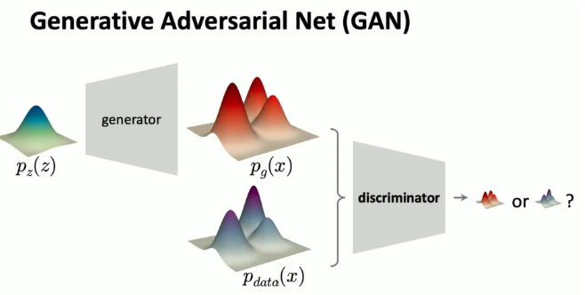

## 1. Generative Modeling
- Mapping between distributions.

### 1.1 Elements of Generative Models

## 2. Modern Approaches to Generative Models  

### 2.1 Variational Autoencoder (VAE)
- 给定数据的分布，训练另一个神经网络，将数据分布映射到你喜欢的分布，比如说高斯分布。然后，在得到这个分布之后，你可以学习生成器将其转换回来。从概念上讲，你计算输入和输出之间的距离。

### 2.2 Generative Adversarial Nets(GAN)  
- GAN 也只是想学习一个生成器，从一个简单的分布到数据分布。但 GAN 并没有在简单分布之前引入另一个网络，而是在你获得估计分布之后引入了一个额外的神经网络。这个额外的神经网络被称为判别器 (discriminator)。判别器的目标是判断你的样本是来自预测分布还是来自真实分布。如果判别器无法判断它来自哪个分布，那么这意味着这两个分布将非常相似。

### 2.3 Autoregressive Models 
- 自然语言处理的上下文中，这通常被称为“下一个词预测”(next token prediction)。但从概念上讲，自回归或自回归的思想不仅仅是预测下一个词。基本上，如果我们关心涉及许多元素或许多变量的概率，那么根据概率论的基本原理，我们总是可以将这个联合概率分解为一系列条件概率。
- 自回归模型的关键思想是分别对每个条件概率进行建模，而不是对整个联合概率进行建模。如果你按照序列的顺序进行这种分解，假设在这种情况下，你想要首先预测 x1，然后预测 x2，条件是 x1，依此类推，如果你遵循这个顺序，那么你可以将你的问题转化为下一个词预测。
- 自回归模型的思想是将一个非常复杂的问题分解为一堆更简单、更小的问题。例如，在这种情况下，在第一个输出中，你将估计一个非常简单且低维的分布。在这个例子中，例如，这将是一个一维分布。然后在第二个节点中，它将预测变量的下一个维度。然后，它将是一个二维分布，依此类推。很难可视化更高维的分布，但从概念上讲，当你这样做时，这将是一个高维空间中的分布。这是自回归模型的关键思想。

### 2.4 Diffusion Models
- 这个模型的灵感来自物理学中的热力学。其思想是，你可以将问题形式化为通过添加高斯噪声来反复破坏干净的数据或输入图像，然后你可以逐步将其转换为完全噪声的图像。然后，学习的目标是逆转这个过程。如果你能做到这一点，那么你就可以逐步从嘈杂的输入回到干净的图像。这个想法被称为扩散 (diffusion)，或者通常也被称为去噪扩散 (denoising diffusion)。

### 2.5 Flow Matching
- 在分布建模的情况下，我们可以将分布字面上想象成一个几何实体。然后，你可以形式化一个过程来进行这种转换, 这是一种新兴的思想，叫做流匹配 (Flow Matching)。例如，你可以想象这个过程的起点是一些圆锥形的形状，比如说一个球体或一个圆柱体。然后，你想要逐步变形或扭曲这个对象、这个形状，变成你喜欢的另一个形状。假设这可以是，例如，一座山或一只兔子。
- 在计算机图形学中，有许多优秀的解决方案可以解决这个问题。这里的一个想法是学习一个流场 (flow field)。你可以想象，如果这实际上是一个 3D 对象，那么你将有一些 3D 顶点或 3D 表面。你想要逐渐将这些 3D 表面从球体移动到兔子中的一些 3D 表面。如果你这样做，那么将有一个流场可以通过这个过程构建。

## 3. Formulate real-world Problems into Generative Modeling
- Generative models are about p(x|y)， x可以是： condition, constraint, labels, attributes, it is more abstract and less informative； y可以是："data", samples, observations, measurements, which is more concrete and more informative.
- 在通用术语中，y 被称为条件 (conditions)。假设你想要生成一只猫，它也可能是一些约束 (constraints)，假设你不希望生成某种类型的输出图像。它也可能是标签 (labels)，文本标签，或者其他标签。它也可能是属性 (attributes)，假设你想要生成一个大的对象或一个小的对象。在大多数情况下，条件 y 会更抽象，信息量也会更少。
- 相比之下，输出 x 通常被称为数据 (data)，或者它是你在现实世界问题中可以看到的样本的观察 (observations) 或测量 (measurements)。在图像生成的情况下，通常 x 就是图像。通常，x 会比条件 y 更具体，信息量更大，维度更高。

## Reference
[1] [Deep Generative Models](https://mit-6s978.github.io/assets/pdfs/lec1_intro.pdf) \
[2] [https://mp.weixin.qq.com/s/9vRYTmasccH-qcW8OvMoWQ?poc_token=HAAGGmijFWDHoVrrysChiKnYSG4BsIpf0atY0X5X](https://mp.weixin.qq.com/s/9vRYTmasccH-qcW8OvMoWQ?poc_token=HAAGGmijFWDHoVrrysChiKnYSG4BsIpf0atY0X5X)