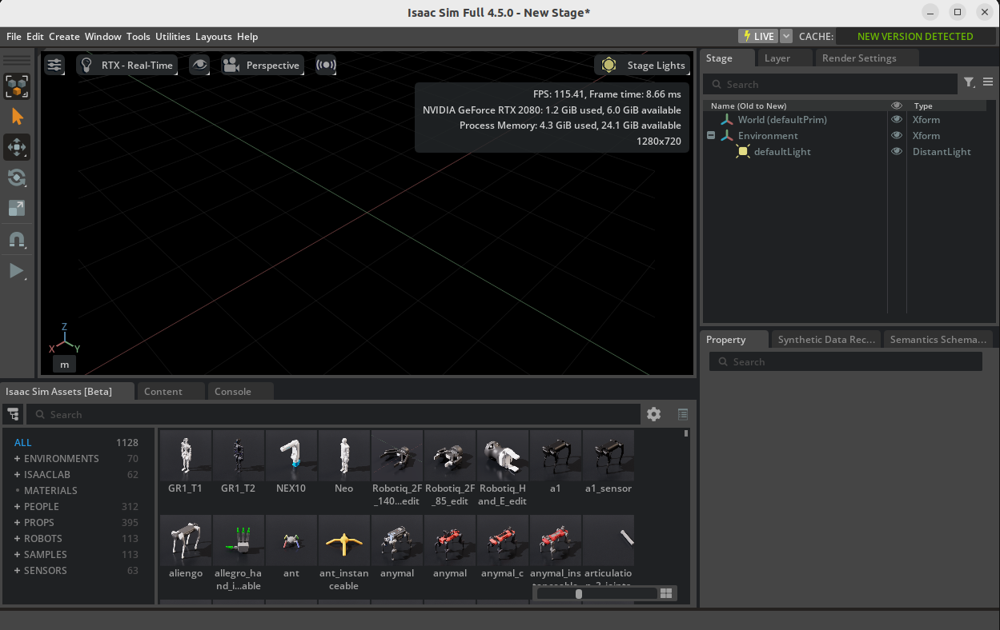

## 1. Install ROS2 Humble

- https://docs.ros.org/en/humble/Installation/Ubuntu-Install-Debs.html

- source /opt/ros/humble/setup.bash

## 2. Install Isaac Sim
- https://docs.isaacsim.omniverse.nvidia.com/4.5.0/installation/install_python.html#installation-using-pip

- source env_isaacsim/bin/activate

## 3. Launch isaacsim
- source /opt/ros/humble/setup.bash
- source env_isaacsim/bin/activate

If launch successfully, the below GUI will be poped.



## 4. Data Collection
```
cd ur5_simulation
colcon build
source ur5_simulation/install/setup.bash 
ros2 launch ur5_moveit_config arm_joy_control.launch.py
python3 ./src/data_collection/scripts/data_collection.py

```

## 5. Model Training
```
cp ur5_simulation/lerobot_related/3_train_policy_mod.py lerobot/example/
python3 3_train_policy_mod.py
```

## 6. Execute T-push task
```
python3 examples/2_evaluate_pretrained_policy_ROS.py
```