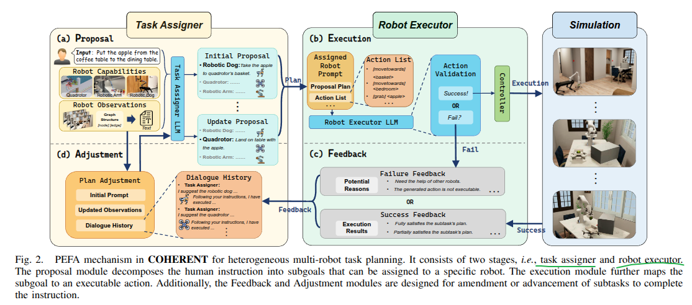

## 1. Multi-robot Learning 

## 2. LLMs for Multi-robot

### 2.1 [COHERENT](https://github.com/MrKeee/COHERENT)
A novel LLM-based task planning framework for collaboration of heterogeneous multi-robot systems including quadrotors, robotic dogs, and robotic arms. Specifically, a Proposal-Execution-Feedback-Adjustment (PEFA) mechanism is designed to decompose and assign actions for individual robots, where a centralized task assigner makes a task planning proposal to decompose the complex task into subtasks, and then assigns subtasks to robot executors. Each robot executor selects a feasible action to implement the assigned subtask and reports self-reflection feedback to the task assigner for plan adjustment. The PEFA loops until the task is completed. 

- Benchmarks: [BEHAVIOR-1K](https://behavior.stanford.edu/behavior-1k)
- Simulation platform: [NVIDIA's Omniverse Isaac Sim](https://docs.omniverse.nvidia.com/app_isaacsim/app_isaacsim/install_workstation.html).
### 2.2 [Generalization of Heterogeneous Multi-Robot Policies via Awareness and Communication of Capabilities](https://sites.google.com/view/cap-comm)

This work aims to tackle the challenge of generalizing learned policies to teams of new compositions, sizes, and robots. 

### 2.3 [Multi-Robot Motion Planning with Diffusion Models](https://openreview.net/forum?id=AUCYptvAf3)
This work proposes a method for generating collision-free multi-robot trajectories that conform to underlying data distributions while using only single-robot data. Our algorithm, Multi-robot Multi-model planning Diffusion (MMD), does so by combining learned diffusion models with classical search-based techniques---generating data-driven motions under collision constraints. 

Challenge: 
 - curse of dimensonality
 - hight sample complexity

### 2.4 [CLAS: Coordinating Multi-Robot Manipulation with Central Latent Action Spaces](https://proceedings.mlr.press/v211/aljalbout23a/aljalbout23a.pdf)
This work proposes an approach to coordinating multi-robot manipulation through learned latent action spaces that are shared across different agent.

### 2.5

### Reference

[5]. [Distributed Planning for Multi-Robot Cooperation](https://backend.orbit.dtu.dk/ws/portalfiles/portal/398932794/PhD_Thesis.pdf)