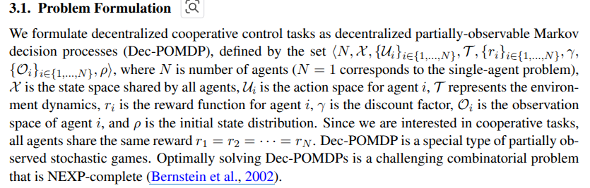
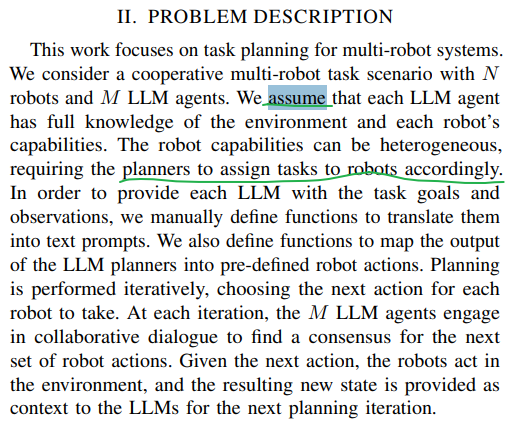

## 1. Multi-robot Learning 

## 2. LLMs for Multi-robot

[LMMs for Multi-robot Systems: A Survey](https://arxiv.org/pdf/2502.03814)

### 2.1 [COHERENT](https://github.com/MrKeee/COHERENT)
A novel LLM-based task planning framework for collaboration of heterogeneous multi-robot systems including quadrotors, robotic dogs, and robotic arms. Specifically, a Proposal-Execution-Feedback-Adjustment (PEFA) mechanism is designed to decompose and assign actions for individual robots, where a centralized task assigner makes a task planning proposal to decompose the complex task into subtasks, and then assigns subtasks to robot executors. Each robot executor selects a feasible action to implement the assigned subtask and reports self-reflection feedback to the task assigner for plan adjustment. The PEFA loops until the task is completed. 

- Benchmarks: [BEHAVIOR-1K](https://behavior.stanford.edu/behavior-1k)
- Simulation platform: [NVIDIA's Omniverse Isaac Sim + ROS1 noetic + OmniGibson](https://docs.omniverse.nvidia.com/app_isaacsim/app_isaacsim/install_workstation.html).

### 2.2 [RoCo: Dialectic Multi-Robot Collaboration with Large Language Models](https://project-roco.github.io/)
- [source code](https://github.com/MandiZhao/robot-collab)

#### 2.2.1 Roco Idea

#### 2.2.2 Challenges
- Robots/tasks heterogeneties
- High-dimensions of configuration space
#### 2.2.3 Methods

### 2.3 [EMOS: Embodiment-aware Heterogeneous Multi-robot Operating System with LLM Agents](https://openreview.net/forum?id=Ey8KcabBpB) - ICLR2025

#### 2.3.1 Problem Description

#### 2.3.2 Experiment
- simulation platform [Habitat-lab 3.0](https://github.com/facebookresearch/habitat-lab) by Meta.

### 2.4 [SMART-LLM: Smart Multi-Agent Robot Task Planning using Large Language Models](https://sites.google.com/view/smart-llm/)
- [[Paper]](https://arxiv.org/abs/2309.10062)[[Code]](https://github.com/SMARTlab-Purdue/SMART-LLM)

#### 2.4.1 Introduction
Smart Multi-Agent Robot Task Planning using Large Language Models (LLMs), harnesses the power of LLMs to convert high-level task instructions provided as input into a multi-robot task plan. It accomplishes this by executing a series of stages, including task decomposition, coalition formation, and task allocation, all guided by programmatic LLM prompts within the few-shot prompting paradigm.

#### 2.4.2 Problem
- multi-robot task allocation

#### 2.4.2 Experiments
- [Benchmark Datasets](https://github.com/SMARTlab-Purdue/SMART-LLM/tree/master/data/final_test)

### 2.5 [Multi-Robot Motion Planning with Diffusion Models](https://openreview.net/forum?id=AUCYptvAf3)
This work proposes a method for generating collision-free multi-robot trajectories that conform to underlying data distributions while using only single-robot data. Our algorithm, Multi-robot Multi-model planning Diffusion (MMD), does so by combining learned diffusion models with classical search-based techniques---generating data-driven motions under collision constraints. 

Challenge: 
 - curse of dimensonality
 - hight sample complexity

### 2.6 [Generalization of Heterogeneous Multi-Robot Policies via Awareness and Communication of Capabilities](https://sites.google.com/view/cap-comm)

This work aims to tackle the challenge of generalizing learned policies to teams of new compositions, sizes, and robots. 

### 2.7 [CLAS: Coordinating Multi-Robot Manipulation with Central Latent Action Spaces](https://proceedings.mlr.press/v211/aljalbout23a/aljalbout23a.pdf)
This work proposes an approach to coordinating multi-robot manipulation through learned latent action spaces that are shared across different agent.

### 2.8 [Scalable Multi-Robot Collaboration with Large Language Models: Centralized or Decentralized Systems?](https://ieeexplore.ieee.org/abstract/document/10610676)

#### 2.8.1 Challenges:
- heterogeneous robot capabilities
- 

#### 2.8.2 Problem Descriptions

#### 2.8.3 Experiments

### Reference
[1]. [Distributed Planning for Multi-Robot Cooperation](https://backend.orbit.dtu.dk/ws/portalfiles/portal/398932794/PhD_Thesis.pdf) \
[2]. [RoboOS: A Hierarchical Embodied Framework for Cross-Embodiment and Multi-Agent Collaboration](https://www.arxiv.org/abs/2505.03673)[[Code]](https://github.com/FlagOpen/RoboOS) \
[3]. [awesome-embodied-vla-va-vln](https://github.com/jonyzhang2023/awesome-embodied-vla-va-vln)