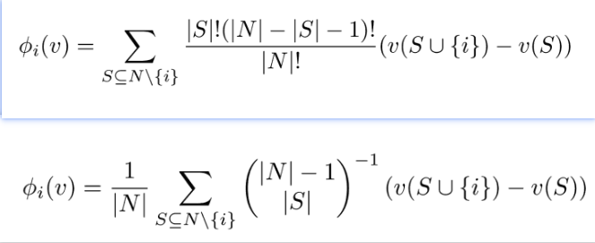
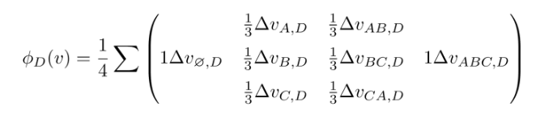

## Shapley Value
In cooperative game theory, the Shapley value is a method (solution concept) for fairly distributing the total gains or costs among a group of players who have collaborated.

Example: 在一个联盟游戏（前面描述的场景）中，我们有一组 N 个玩家。我们还有一个函数 v，它给出了这些参与者的任何子集的值，也就是说，S 是 N 的子集，然后 v（S）给出了该子集的值。因此，对于一个联合博弈（N，v），我们可以使用这个方程来计算玩家 i 的贡献，即 Shapley 值。

*Imagine a multi-agent system where robots collaborate to complete a task. The value of the task completion depends on the combined effort of the robots. Using Shapley values, you can determine which robots contribute the most to the task's success. If a robot consistently improves the outcome when added to different robot groups, its Shapley value will be high, indicating its valuable contribution and making it a desirable partner. 

## Conclusion form AI
The Shapley value, a concept from cooperative game theory, can be applied to multi-agent partner selection to fairly allocate rewards or credit based on each agent's contribution to a coalition. This approach helps determine which agents are most valuable in a team and how to distribute benefits proportionally to their individual contributions. 
Here's how Shapley values are used in multi-agent partner selection:
1. Defining the Game:
Agents: Represent individual entities in a multi-agent system (e.g., robots, software agents, players in a game).
Coalitions: Represent different combinations of agents working together.
Value Function: Defines the "worth" or outcome of each coalition. This could be a reward, a performance metric, or any other relevant measure of success. 
2. Calculating Shapley Values:
For each agent, the Shapley value is calculated by considering all possible coalitions they could be a part of.
For each coalition, the marginal contribution of the agent is the difference in the coalition's value with and without the agent.
The Shapley value is the average of these marginal contributions across all possible coalitions, weighted by the probability of the agent being in each coalition. 
3. Partner Selection:
The Shapley values can be used to rank agents based on their contributions.
Agents with higher Shapley values are considered more valuable and are more likely to be selected as partners.
This approach ensures a fairer distribution of rewards, as it takes into account the individual contributions of each agent to the overall success of the coalition. 
Example:
* Imagine a multi-agent system where robots collaborate to complete a task. The value of the task completion depends on the combined effort of the robots. Using Shapley values, you can determine which robots contribute the most to the task's success. If a robot consistently improves the outcome when added to different robot groups, its Shapley value will be high, indicating its valuable contribution and making it a desirable partner. 
Benefits of using Shapley values for partner selection:
*Fairness:
Shapley values provide a fair way to distribute credit and rewards based on individual contributions.
Interpretability:
Shapley values offer insights into why certain agents are more valuable than others.
* Efficiency:
The approach can be used to optimize partner selection for better overall performance. 
* Variations and Extensions:
Bilateral Shapley Value (BSV):
This variation focuses on pairwise interactions between agents, useful when considering partnerships between two agents. 
Multi-perturbation Shapley analysis (MSA or MPA):
This method treats each element in a network as a player and analyzes the impact of removing or perturbing each element on the overall network performance. 
* Shapley Q-value:
This approach uses Shapley values to assign credit to individual agents in multi-agent reinforcement learning (MARL) scenarios. 
In conclusion, the Shapley value offers a robust and theoretically sound method for multi-agent partner selection by quantifying individual agent contributions to cooperative tasks and guiding fair and efficient coalition formation

## Reference
1. "Shapley Value Based Multi-Agent Reinforcement Learning: Theory, Method and Its Application to Energy Network" [[PHD Thesis]](https://arxiv.org/abs/2402.15324)
2. "Collective eXplainable AI: Explaining Cooperative strategies and agent contribution in Multiagent Reinforcement Learning with Shapley Values" [[Paper]](https://arxiv.org/abs/2110.01307)[[Code]](https://github.com/Fabien-Couthouis/XAI-in-RL)
    * MONTE CARLO APPROXIMATION OF SHAPLEY VALUES
3. "Adaptive Value Decomposition with Greedy Marginal Contribution Computation for Cooperative Multi-Agent Reinforcement Learning" [[Paper]](https://arxiv.org/abs/2302.06872)
4. "Heterogeneous Value Decomposition Policy Fusion for Multi-Agent Cooperation" [[Paper]](https://arxiv.org/abs/2502.02875)
5. "SHAQ: Incorporating Shapley Value Theory into Multi-Agent Q-Learning" [[Paper]](https://openreview.net/forum?id=GQcB1D2bxSC) 
6. "Partner Selection for the Emergence of Cooperation in Multi-Agent Systems Using Reinforcement Learning" [[Paper]](https://arxiv.org/abs/1902.03185)
7. "Shapley Library" [[Code]](https://shap.readthedocs.io/en/latest/index.html) [[Shapley Value + PPO]](https://github.com/MaximeSzymanski/PPO)
8. "Adaptive Value Decomposition with Greedy Marginal Contribution Computation for Cooperative Multi-Agent Reinforcement Learning" [[Paper]](https://arxiv.org/abs/2302.06872)
9. https://zhuanlan.zhihu.com/p/91834300
10. https://en.wikipedia.org/wiki/Shapley_value

