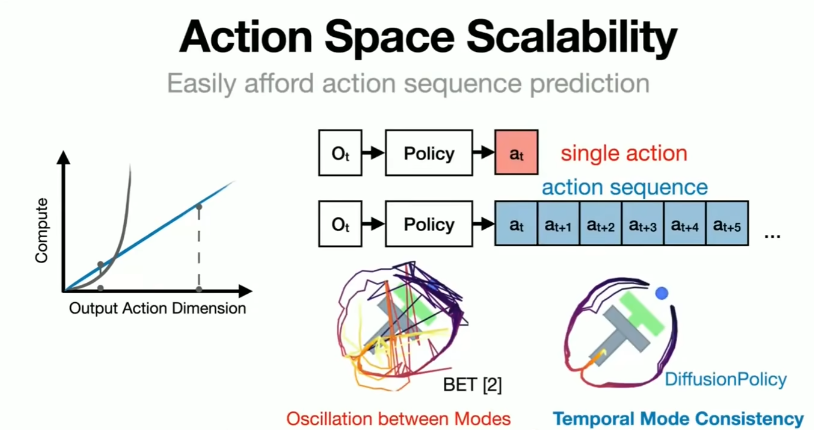

## 1. Robotic Learning Directions
- Vision-Language-Model (VLM): VLM act as an agent that can genrate task execution function code. e.g, ReKep, Voxposer
- Behaviror cloning(BC): learning from demonstration data and generate action sequences. e.g., Action chunking, Policy diffusion, Flow matching
- Vision-language-action (VLA): genration action sequence end-to-end. e.g., Issac GR001, Pi-0, OpenVLA.
- VLM + VLA: slow think (VLM) for planning and fast think for action generation (VLA). e.g., [figureAI](https://www.figure.ai/)

    System 2 (S2): An onboard internet-pretrained VLM operating at 7-9 Hz for scene understanding and language comprehension, enabling broad generalization across objects and contexts.

    System 1 (S1): A fast reactive visuomotor policy that translates the latent semantic representations produced by S2 into precise continuous robot actions at 200 Hz.

### 1.1 VLA types
- Type-1: Use VLM/LLM as a high level planner, low level controls are handled by individual policies eg: ReKep, Voxposer, SayCan, PaLM-E 
- Type-2: Uses an Image or Video Generation model as a high level planner eg: Berkeley’s SuSIE 
- Type-3: Hybrid approach combining both Type-1 and Type-2 to plan about intermediate tasks. eg: HybridVLA 
- Type-4: Use a single VLM for end-to-end control for perception, planning and control 
- Type-5: VLM’s for high level planning and diffusion models to execute these instructions
eg: Groot N1 , Octo, OpenVLA

## 2. Vision-Language-Model
Input the image observation of robots to large-vision model and the human prompt to vision luange model, finally genration the code that contains the tasks execution functions.

Please see the below typical research article named [ReKep](https://arxiv.org/abs/2409.01652) that proposed by FeiFei Li team.

## 2. Behavior clone
### 2.1 Action Chunking
Action chunking is an open-loop control where at every control time step, a policy outputs a chunk (sequence) of actions into the future given the current observation. Usually the action sequence will be fully or partially executed before the next control time step.

For example, in robotic manipulation, the action "set the table" can be chunked into smaller steps such as "pick up the plate," "place the plate on the table," and "adjust the plate's position."

This is in contrast to the typical closed-loop control, where the policy observes the current observation, outputs only one action, observes the next observation, and so on.

### 2.2 Diffusion Policy ([Chi et al. 2023](https://www.bilibili.com/video/BV1ZaeAe7EMu/?spm_id_from=333.337.search-card.all.click&vd_source=5acd2d369a16a68747ef0223c2f4a7a4))

#### 2.2.1 Action Space Scalability: easily afford action sequence prediction

## 3. VLA Research Questions
Survey paper: [Towards Generalist Robot Policies: What Matters in Building Vision-Language-Action Models](https://robovlms.github.io/)

## 3.1 Vision-language-action(VLA)
### 3.1.1 VLA Formuation

### 3.1.2 Backbone architecture

Flamingo and OFA: 1) encoder-decoder -- an encoder that is typically responsible for extracting features from inputs using input embedding modules as discussed above, and a decoder that generates the output (e.g., text or multi-modal predictions) auto-regressive.

LLaVA, GPT-4V: 2)Decoder-only -- Decoder-only architectures, in contrast, rely on a unified transformer framework where both the input modalities (vision and text) and the output sequences are processed in the same auto-regressive decoder. 

### 3.1.3 Action Prediction
<!--  -->

### 3.1.4 Flow Matching ([Physical Intelligence 2024](https://www.physicalintelligence.company/download/pi0.pdf).)

Flow matching is used for generative modeling[Yaron et.al.](https://arxiv.org/pdf/2210.02747), which is a variant of diffusion.

Pi0 eploys a novel design that fine-tunes a VLM to produce actions via flow matching, which can handle high-frequency action chunks.

## 4. Open source VLA
### 4.1 [Octo from UC Berkeley](https://github.com/octo-models/octo.git)
Octo (93M) is an open source transformer based generalist policy trained on 800,000 robot demonstrations from OpenX-Embodiment Dataset and it performs on par with behemoth models like RT-2 (55B). All of the robotic data is taken, converted into a sequence of input tokens, and passed through the Octo transformer.

At first the input instructions are passed as task tokens to the language encoder, along with a patched image passed to a CNN encoder as observation tokens. Then, the embeddings of the Octo transformer are decoded to output action tokens using a diffusion head. The authors report that, unlike discrete action tokens, diffusion based decoders works best.
Octo has three variants: Octo-Tiny, Octo-Small,  Octo-Base (~93M)

### 4.2 [OpenVLA from Stanford](https://openvla.github.io/)
OpenVLA is a open source 7B parameter model trained on 970K episodes of Open X-Embodiment dataset for generalist robotic manipulation tasks.

It consists of three main components:

- Vision Encoder: Uses a dual vision encoder approach with DINOv2 (~300M) and SigLIP (~400M) which takes in an image and creates embeds flattened patches. DINOv2 excels at spatial relationships while SigLIP offers strong language alignment properties. To adapt the vision encoders to new tasks like action prediction it is important to unfreeze and train these model layers as well.
- Projector: Vision embeddings are mapped into a shared embedding space of LLM using an MLP projector.
- LLM: Llama2 7B model takes in an language instruction and is tokenized. The vision embeddings and text tokens together is passed as a sequence to LLM to generate actions such as changes in position, rotation and gripper state which can be directly used as continuous signals to control robots end effector.

Franka Emika Panda 7-DoF robot arm is used as test bed operating at 5Hz for evaluation and benchmarks. The project also added support for parameter efficient fine-tuning techniques like LoRA and experimental results shows these PEFT models perform on par with the original model.

### 4.3 [Pi0 Physical Intelligence](https://github.com/huggingface/lerobot.git)
π is a foundational Vision-Language-Action Flow Model for general robot control from Physical Intelligence with two variants π0 (Pi-Zero) and π0 Fast. It comprises of a ~3B pretrained Paligemma VLM model as base backbone and an additional 300M diffusion model as an action expert trained on π Cross-Embodiment Robot dataset. VLAs has additional action and state tokens appended at the end of image and text tokens. The model is pretrained with massive, diverse dataset and

- VLM: The VLM uses SigLIP as image encoder an Gemma for language commands. The VLM doesn’t see the future robot state/actions tokens preventing the model from any sort of confusion to interpret visual information from its pre-trained knowledge. By adapting this VLM to also act an action expert is added which tightly works with VLM.

- Action Expert: The action expert attends to all the previous vision/language/robot state tokens which represents the full scene to produce context-conditioned actions. Instead of just one action (discrete) token, it generates continuous sequences of action tokens (H = 50) by using conditional flow matching for smooth and realistic movements.

Actions are n-dimensional vectors action representation(v_\theta) with magnitude and direction that can be tokenized. Similar to image generation diffusion models, Flow matching starts from a random noise (A_\tau = \tau A_t + (1-\tau) \cdot \text{noise}) and converges to a sequence of meaningful motor actions (that’s close to Target: u = noise - At) iteratively to produce smooth motor actions for dexterous hand movements to fit the observation.

New_Action = Old_Action + step_size * v_\theta

Most existing VLAs use discrete action tokenization, converting continuous actions into discrete tokens generated autoregressively. But they have are inefficient for high-frequency real-time controls such as in  π0 at 50Hz. This enables robots to perform a diverse range of tasks with higher efficiency and adaptability.

### 4.4 [GR00T N1 from Nvidia](https://github.com/NVIDIA/Isaac-GR00T)
Following the same architectural and design principles of Helix, Nvidia released GR00T N1, an open foundational model for generalist humanoid reasoning and control. N1 is a 2B parameter model (eagle2_hg_model backbone) trained on massive set of both synthetic from Omniverse and Cosmos along with real captured data of humanoid robot dataset. Pretrained policies can be seamlessly adapted to cross embodied systems.

Observation, language instruction and robot state are encoded as tokens and is passed to System 2 and System 1 to predict action tokens that can directly control the robots.

System 2: VLM that interprets phsical world with vision and language instructions by reasoning over to plan the right actions.

System 1: A Diffusion Transformer that follows the instructions of System 2 by denoising to produce meaningful smooth and precise motor actions at 120Hz.

### 4.5  [Gemini Robotics](https://arxiv.org/abs/2503.20020)
Google Deepmind introduced Gemini Robotics which is powered by powerful Gemini 2.0 multimodal. This enables to perform high frequency motor control at 20Hz, dexterous tasks and perform complex daily tasks precisely.

The family consists of two primary models:

- Gemini Robotics-ER (Embodied Reasoning): This uses native Gemini 2.0 without fine-tuning on any robot action data. It purely dependent on the superior spatial-relationship and vast internet pretrained knowledge about robot concepts.
- Gemini Robotcs: Extending Gemini Robotics-ER by fine-tuning on action data for direct robot control. Its is a single unified model that handles perception, reasoning and action generation without separate diffusion.

Architecture: For high level reasoning and perception, a distilled version of Gemini Robotics-ER is hosted in cloud. However to compensate for the network latency and generate low-level action sequences an action decoder runs in robot’s onboard computer.

## 5. Open source datasets

## Reference
[1]. [Rekep spatio-temporal reasoning of relational keypoint constraints for robotic manipulation](https://arxiv.org/abs/2409.01652)
[2]. [Learning Fine-Grained Bimanual Manipulation with Low-Cost Hardware](https://arxiv.org/pdf/2304.13705) \
[3]. [Action chunking vs closed-loop control](https://www.haonanyu.blog/post/action_chunking/) \
[4]. [Diffusion Policy](https://diffusion-policy.cs.columbia.edu/) [[Source Code]](https://github.com/real-stanford/diffusion_policy) [[Video]](https://www.bilibili.com/video/BV1ZaeAe7EMu/?spm_id_from=333.337.search-card.all.click&vd_source=5acd2d369a16a68747ef0223c2f4a7a4 ) \
[5]. [Flow matching for generative modeling](https://arxiv.org/pdf/2210.02747) \
[6]. [Transfusion: Predict the Next Token and Diffuse Images with One Multi-Modal Model](https://arxiv.org/abs/2408.11039) \
[7]. [π0: A Vision-Language-Action Flow Model for
General Robot Control](https://www.physicalintelligence.company/download/pi0.pdf) \
[8] [Gemini Robotics: Bringing AI into the Physical World
](https://arxiv.org/abs/2503.20020) \
[9]. [Issac Sim](https://www.nvidia.cn/training/learning-path/robotics/) 
